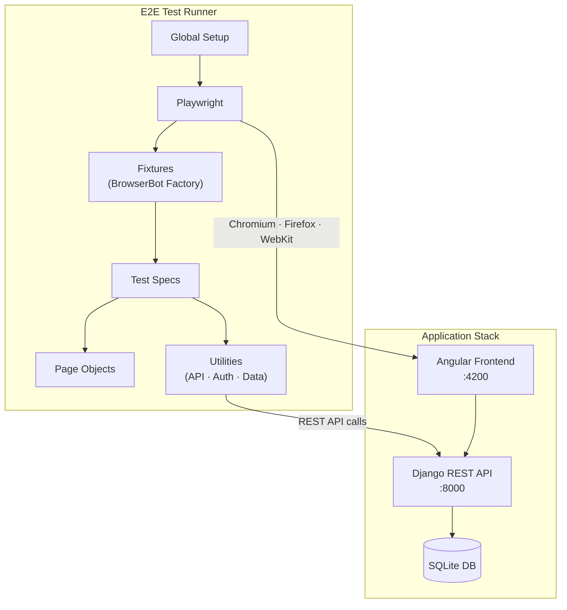

# E2E Tests

End-to-end tests for the **RealWorld Django REST Framework + Angular** application using [Playwright](https://playwright.dev/).

This test suite automatically opens real web browsers (Chrome, Firefox, and Safari), interacts with the application the way a real user would -- clicking buttons, filling out forms, navigating between pages -- and verifies that everything works correctly. It covers the most critical user journeys: signing up, signing in, creating and editing articles, following other users, and commenting. If any of these workflows break, the tests will catch it before the code reaches production.

---

## Table of Contents

- [Test Coverage](#test-coverage)
- [Architecture](#architecture)
- [Project Structure](#project-structure)
- [System Requirements](#system-requirements)
- [Running Tests](#running-tests)
  - [Inside Docker (Recommended)](#inside-docker-recommended)
  - [Outside Docker (Local)](#outside-docker-local)
- [Configuration](#configuration)
- [Understanding the Codebase](#understanding-the-codebase)
  - [Custom Fixtures & BrowserBot Pattern](#custom-fixtures--browserbot-pattern)
  - [Page Object Model](#page-object-model)
  - [Test Data Management](#test-data-management)
  - [Utility Classes](#utility-classes)
- [Design Decisions](#design-decisions)
- [Code Quality](#code-quality)
- [CI/CD Integration](#cicd-integration)
- [Writing a New Test](#writing-a-new-test)
- [Test Reports](#test-reports)
- [Troubleshooting](#troubleshooting)
- [Future Enhancements](#future-enhancements)

---

## Test Coverage

Every test runs across three browser engines -- **Chromium** (Chrome/Edge), **Firefox**, and **WebKit** (Safari) -- to ensure cross-browser compatibility.

| Test File | User Journey | What It Verifies |
|---|---|---|
| `010-signup.spec.ts` | A new user signs up | Filling out the signup form creates an account and lands the user on the home page |
| `011-signin.spec.ts` | An existing user signs in | Valid credentials grant access; invalid credentials show an error |
| `020-create-article.spec.ts` | A signed-in user creates an article | The article appears on the user's profile after creation |
| `030-follow-feed.spec.ts` | User A follows User B | User B's articles appear in User A's personal feed |
| `040-modify-article.spec.ts` | A user edits and deletes their article | Article content updates correctly; deleted articles are removed |
| `050-comments.spec.ts` | A user adds and removes a comment | Comments appear under the article and can be deleted |

---

## Architecture



---

## Project Structure

```
e2e/
├── fixtures/                  # Playwright custom fixtures
├── pages/                     # Page Object Model classes
├── tests/                     # Test spec files
├── utils/                     # Shared utility modules
├── results/                   # Test output (gitignored except .gitkeep)
├── playwright.config.ts       # Playwright configuration
├── global-setup.ts            # Pre-test health checks for frontend & backend
├── tsconfig.json              # TypeScript configuration with path aliases
├── eslint.config.mjs          # ESLint flat config (with Playwright plugin)
├── .prettierrc.json           # Prettier formatting rules
├── .env.example               # Environment variable template
├── Dockerfile                 # Docker image for running tests
├── docker-compose.e2e.yml     # Docker Compose service definition
├── package.json               # Dependencies and npm scripts
└── package-lock.json          # Locked dependency versions
```

---

## System Requirements

- **Docker** (recommended) -- for containerized test execution with pre-installed browsers (Chromium, Firefox, WebKit). Setup instructions are [here](https://docs.docker.com/get-started/get-docker/).
- **Node.js** (for local runs) -- install Playwright browsers separately with `npx playwright install --with-deps`. Setup instructions are [here](https://nodejs.org/en/download).

---

## Running Tests

**Pre-requisites:**
- Start the application using Docker Compose:

```bash
docker compose up -d
```

### Inside Docker (Recommended)


Docker ensures consistent browser versions and system dependencies across all environments. The container uses `network_mode: host`, so `localhost` inside the container points to your host machine.

```bash
# Run all tests (from the project root)
docker compose -f e2e/docker-compose.e2e.yml run --rm e2e

# Rebuild after changing package.json or Dockerfile
docker compose -f e2e/docker-compose.e2e.yml run --rm --build e2e

# Run a specific test file
docker compose -f e2e/docker-compose.e2e.yml run --rm e2e npx playwright test tests/010-signup.spec.ts

# Run tests for a specific browser
docker compose -f e2e/docker-compose.e2e.yml run --rm e2e npx playwright test --project=chromium
```

---

### Outside Docker (Local)

Running locally gives you access to headed mode.

**One-time setup:**

```bash
cd e2e
npm install
npm run setup
cp .env.example .env   # Edit if your app runs on non-default ports
```

**Run tests:**

```bash
cd e2e

npm test                    # All tests (headless)
npm run test:headed         # All tests with visible browser
npm run test:chromium       # Chromium only
npm run test:firefox        # Firefox only
npm run test:webkit         # WebKit (Safari) only

# Run a specific test file
npx playwright test tests/020-create-article.spec.ts

# Run tests matching a keyword
npx playwright test -g "sign up"

# Debug with Playwright Inspector
npx playwright test tests/010-signup.spec.ts --debug
```

---

## Configuration

### Environment Variables

All environment variables are optional -- defaults are provided in `playwright.config.ts`. For local runs, copy `.env.example` to `.env`. Docker users don't need a `.env` file (values are set in `docker-compose.e2e.yml`).

| Variable | Default | Description |
|---|---|---|
| `BASE_URL` | `http://localhost:4200` | Angular frontend URL |
| `API_URL` | `http://localhost:8000/api/` | Django REST API URL (include trailing slash) |
| `CI` | `false` | Set to `true` in CI environments (disables `test.only`, sets retries to 2) |
| `RETRIES` | `0` (local) / `2` (CI) | Number of times to retry a failed test |
| `WORKERS` | auto (half CPU cores) | Number of parallel worker processes |
| `TEST_TIMEOUT` | `60000` | Max time (ms) for a single test |
| `ACTION_TIMEOUT` | `10000` | Max time (ms) for a single action (click, fill, etc.) |
| `NAVIGATION_TIMEOUT` | `30000` | Max time (ms) for page navigation |
| `EXPECT_TIMEOUT` | `10000` | Max time (ms) for `expect()` assertions |

---

## Understanding the Codebase

### Custom Fixtures & BrowserBot Pattern

Instead of using Playwright's default `test` directly, we extend it with custom fixtures in `fixtures/index.ts`.

**What is a `BrowserBot`?**

A `BrowserBot` bundles everything needed to interact with the app as a single user:

```typescript
interface BrowserBot {
  browserContext: BrowserContext;  // Isolated browser session
  page: Page;                     // The browser tab
  homePage: HomePage;             // Page object instances
  signupPage: SignupPage;
  signinPage: SignInPage;
  feedPage: FeedPage;
  articlePage: ArticlePage;
  profilePage: ProfilePage;
  authUtils: AuthUtils;           // Inject auth tokens
}
```

**Why a factory?** `createBrowserBot` is a factory function -- you can create multiple bots in a single test for multi-user scenarios (e.g., User A follows User B):

```typescript
test('multi-user interaction', async ({ createBrowserBot }) => {
  const userA = await createBrowserBot(tokenA);
  const userB = await createBrowserBot(tokenB);

  await userA.profilePage.navigateToUser(userB_username);
  await userA.profilePage.followUser();
  // ...
});
```

Passing a `token` to `createBrowserBot(token)` navigates to the home page, injects the auth token into `localStorage`, and reloads -- skipping the login UI entirely.

### Page Object Model

Every page has a corresponding class in `pages/`. Each page object:

1. **Extends `BasePage`** which provides `refreshPage()` and wait helpers (`waitForVisible()`, `waitForHidden()`, `waitForDetached()`, `waitForAttached()`).
2. **Defines locators** as `readonly` properties using Playwright's recommended locator strategies (`getByRole`, `getByPlaceholder`, etc.).
3. **Exposes action methods** that encapsulate user interactions.
4. **Handles waiting internally** so tests don't need explicit `waitFor` calls.

### Test Data Management

Test data is defined in `utils/test-data.yml` and accessed through `getUser()` and `getArticle()` in `utils/data.utils.ts`.

Each call appends a random UUID suffix to usernames, emails, titles, etc., ensuring tests don't collide when running in parallel:

```typescript
const user = getUser('signUp');
// → { username: "signupuser_a1b2c3d4e5f6", email: "signupuser_a1b2c3d4e5f6@example.com", ... }
```

### Utility Classes

| Class / Function | File | Purpose |
|---|---|---|
| `ApiUtils` | `utils/api.utils.ts` | REST API calls for test data setup (`registerUser`, `getAuthToken`, `createArticle`). Includes retry logic for 5xx errors. |
| `AuthUtils` | `utils/auth.utils.ts` | Injects an auth token into `localStorage` and reloads the page. |
| `getUser()` / `getArticle()` | `utils/data.utils.ts` | Reads test data from YAML and appends UUID suffixes for uniqueness. |
| `waitUntilServiceIsReady()` | `utils/setup.utils.ts` | Polls a URL until it responds with HTTP 200 (used in global setup). |
| `User` / `Article` | `utils/types.utils.ts` | TypeScript interfaces for test data objects (used throughout tests and utilities). |

---

## Design Decisions

| Decision | Rationale |
|---|---|
| **Playwright** over Cypress or Selenium | Playwright supports all three major browser engines (Chromium, Firefox, WebKit) out of the box, has built-in auto-wait for elements, and provides powerful debugging tools like the Trace Viewer. It also runs tests faster through native parallelism. |
| **Page Object Model** | Separates "how to interact with the UI" from "what the test is checking." When the UI changes (e.g., a button is renamed), only the page object needs updating -- every test that uses it keeps working without modification. |
| **BrowserBot factory pattern** | Enables multi-user scenarios in a single test (e.g., User A follows User B) by creating independent browser sessions on demand, each with their own page objects. |
| **YAML for test data** | Keeps test data human-readable and separate from test logic. Non-technical team members can review or update usernames, emails, and article content without touching TypeScript code. |
| **UUID suffixes on test data** | Guarantees test isolation when running in parallel -- each test gets unique usernames, emails, and article titles, so tests never interfere with each other. |
| **API-based test setup** | Tests that need a pre-existing user or article create them via the REST API in `beforeAll`, rather than clicking through the UI. This makes setup fast, reliable, and independent of UI changes. |
| **Docker for test execution** | Eliminates "works on my machine" issues. The Docker image bundles exact browser versions and system libraries, so tests behave identically on every developer's machine and in CI. |
| **Global setup with health checks** | Before any test runs, the global setup polls the frontend and backend URLs until they respond. This prevents false failures caused by the application still starting up. |

---

## Code Quality

The codebase enforces consistent style and catches common mistakes through automated tooling:

- **ESLint** with the [Playwright plugin](https://www.npmjs.com/package/eslint-plugin-playwright) -- enforces Playwright best practices (e.g., preferring web-first assertions, avoiding manual waits).
- **Prettier** -- ensures consistent formatting (semicolons, single quotes, trailing commas, 120-character line width) across all TypeScript files.
- **TypeScript strict mode** -- catches type errors at compile time rather than at runtime.

Linting and formatting are checked automatically in CI (see below), so code that doesn't meet standards cannot be merged.

---

## CI/CD Integration

Tests run automatically on every push and pull request via **GitHub Actions**. The CI pipeline (`.github/workflows/ci.yml`) runs several jobs in parallel: **linting** (pre-commit hooks), **Angular tests**, **Django tests**, and **E2E tests**.

The E2E job performs the following steps:

1. **Install dependencies** -- `npm install` in the `e2e/` directory.
2. **Lint** -- checks for ESLint violations (`npm run lint`).
3. **Format check** -- verifies Prettier formatting (`npm run format:check`).
4. **Start the application** -- launches the full stack (frontend + backend + database) using `docker compose up -d`.
5. **Run E2E tests** -- executes the test suite inside a Docker container for consistency.
6. **Stop the application** -- tears down the stack with `docker compose down`.
7. **Upload test results** -- saves the HTML report, screenshots, videos, and traces as downloadable artifacts attached to the workflow run.

This ensures that no code is merged without passing all E2E tests, and that failing test artifacts are always available for investigation.

---

## Writing a New Test

### Step 1: Add Test Data (if needed)

Add entries to `utils/test-data.yml`:

```yaml
users:
  myFeatureUser:
    username: myfeatureuser
    email: myfeatureuser@example.com
    password: password123
```

### Step 2: Create the Test File

Create `tests/NNN-feature-name.spec.ts`:

```typescript
import { test, describe, expect, beforeAll } from '@fixtures';
import { getUser, User } from '@utils';

describe('My Feature', () => {
  let user: User;
  let token: string;

  beforeAll(async ({ apiUtils }) => {
    user = getUser('myFeatureUser');
    await apiUtils.registerUser(user);
    token = await apiUtils.getAuthToken(user.email, user.password);
  });

  test('Should do something expected', async ({ createBrowserBot }) => {
    const bot = await createBrowserBot(token);

    await bot.feedPage.navigateTo();
    await bot.feedPage.waitUntilPageIsLoaded();

    await expect(bot.feedPage.feedToggle).toBeVisible();
  });
});
```

### Step 3: Add a Page Object (if needed)

Create a class in `pages/` extending `BasePage`, then:
1. Export it from `pages/index.ts`.
2. Add it to the `BrowserBot` interface and factory in `fixtures/index.ts`.

### Step 4: Run Your Test

**Inside Docker:**

```bash
docker compose -f e2e/docker-compose.e2e.yml run --rm e2e npx playwright test tests/060-my-feature.spec.ts
```

**Outside Docker (local):** gives you access to headed mode and the Playwright Inspector.

```bash
cd e2e

# Headless
npx playwright test tests/060-my-feature.spec.ts

# With visible browser
npx playwright test tests/060-my-feature.spec.ts --headed

# Debug with Playwright Inspector
npx playwright test tests/060-my-feature.spec.ts --debug
```

---

## Test Reports

After running tests, open the HTML report:

```bash
npm run report
```

Report artifacts are saved in `results/`:

| Path | Contents |
|---|---|
| `results/playwright-report/` | Interactive HTML report |
| `results/test-results/` | Screenshots (on failure), videos (on first retry), traces (on first retry) |

**Viewing a trace** (useful for debugging failures):

1. Open the HTML report, click a failed test, and click the "Trace" link to open Playwright's Trace Viewer.
2. Or view directly: `npx playwright show-trace results/test-results/<test-folder>/trace.zip`

---

## Troubleshooting

| Problem | Cause | Fix |
|---|---|---|
| "Frontend is not available" / "Backend is not available" | Application isn't running | Start the frontend on `:4200` and backend on `:8000`. Verify with `curl`. |
| "Executable doesn't exist" | Playwright browsers not installed | Run `npx playwright install --with-deps` |
| Tests pass locally but fail in Docker | Timing differences in containers | Increase timeouts in `docker-compose.e2e.yml`. `WORKERS=1` is already set there by default. |
| "ECONNREFUSED" in API calls | `API_URL` is wrong or backend is down | Check `.env` -- `API_URL` must end with a trailing slash (`http://localhost:8000/api/`) |
| Flaky tests | Race conditions or shared state | Ensure page objects use proper wait calls. Each `describe` block should create its own data via `getUser()`/`getArticle()`. |

---

## Future Enhancements

The following improvements would increase the robustness, coverage, and usefulness of the test suite:

| Enhancement | Description |
|---|---|
| **Negative / edge-case testing** | Add tests for invalid inputs (empty fields, overly long text, special characters), network error handling, and unauthorized access to protected routes. |
| **Visual regression testing** | Use Playwright's built-in screenshot comparison (`toHaveScreenshot()`) to detect unintended visual changes in the UI across releases. |
| **Database seeding / teardown** | Replace API-based setup with direct database seeding for faster and more reliable test data creation, and clean up data after each test run to keep environments pristine. |
| **Tag-based test execution** | Add tags (e.g., `@smoke`, `@regression`) to tests so that CI can run a fast smoke suite on every commit and the full regression suite on a schedule or before releases. |
| **Mobile viewport testing** | Add Playwright projects with mobile device emulation (viewport size, touch events, user agent) to verify responsive design. |

---